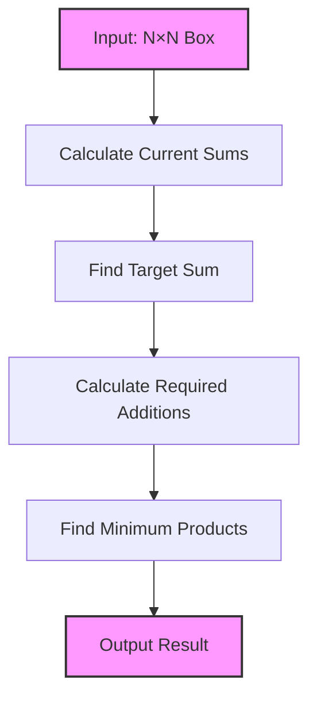
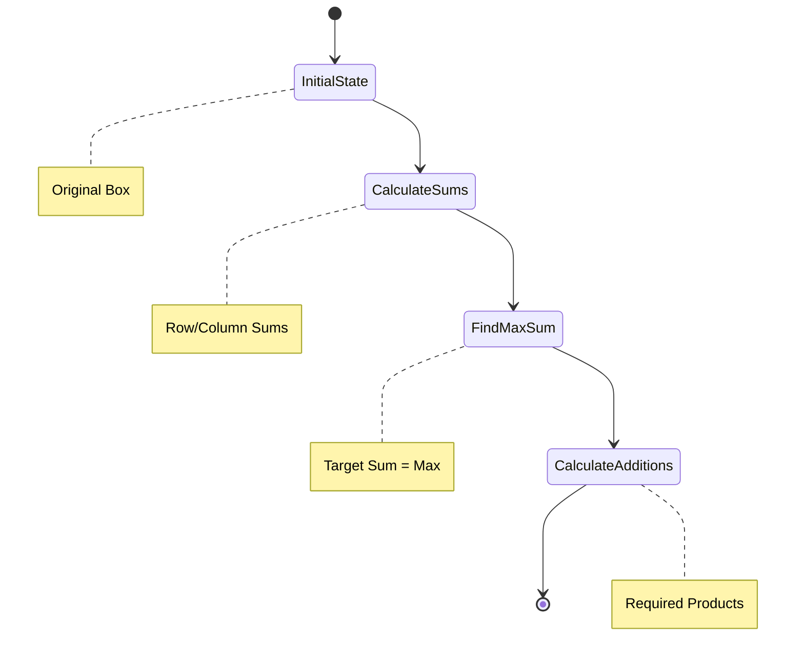

# Balancing Problem Solution

## Problem Understanding

### Requirements
1. Given an N×N lattice box with products
2. Need to balance the box so sum of products in each row and column is equal
3. Can only add products (cannot remove existing ones)
4. Must minimize the total quantity of products added
5. N is the size of box (1 ≤ N ≤ 150)
6. Each lattice can contain up to 200 products



## Solution Approach

### Step 1: Calculate Maximum Sum
- Find the maximum sum among all rows and columns
- This becomes our target sum (all rows and columns must reach this)

### Step 2: Calculate Required Additions
- For each row/column, calculate difference from target sum
- These differences represent minimum products needed

### Complete Solution Code

```java
import java.util.Scanner;

public class Main {
    int N;
    int Box[][];
    
    void InputData() {
        Scanner sc = new Scanner(System.in);
        N = sc.nextInt();
        Box = new int[N][N];
        for(int i=0; i<N; i++) {
            for(int j=0; j<N; j++) {
                Box[i][j] = sc.nextInt();
            }
        }
        sc.close();
    }
    
    public static void main(String[] args) {
        int ans = -1;
        Main m = new Main();
        m.InputData();
        ans = m.solve();
        System.out.println(ans);
    }
    
    int solve() {
        // Find current sums for rows and columns
        int[] rowSums = new int[N];
        int[] colSums = new int[N];
        int maxSum = 0;
        
        // Calculate row and column sums
        for(int i = 0; i < N; i++) {
            for(int j = 0; j < N; j++) {
                rowSums[i] += Box[i][j];
                colSums[j] += Box[i][j];
            }
            maxSum = Math.max(maxSum, rowSums[i]);
        }
        
        for(int j = 0; j < N; j++) {
            maxSum = Math.max(maxSum, colSums[j]);
        }
        
        // Calculate minimum products needed
        int totalProductsNeeded = 0;
        for(int i = 0; i < N; i++) {
            totalProductsNeeded += maxSum - rowSums[i];
        }
        
        return totalProductsNeeded;
    }
}
```

## Example Walkthrough

### Example 1:
Input Box:
```
1 2 3
4 2 3
3 2 1
```

Process:
1. Calculate current sums:
   - Row sums: 6, 9, 6
   - Column sums: 8, 6, 7
   - Maximum sum = 9

2. Required additions:
   - Row 1: 9-6 = 3 products
   - Row 2: 9-9 = 0 products
   - Row 3: 9-6 = 3 products
   - Total = 6 products



## Key Points to Remember

1. Time Complexity: O(N²)
   - One pass to read input: O(N²)
   - One pass to calculate sums: O(N²)
   - One pass to calculate additions: O(N)

2. Space Complexity: O(N²)
   - Box array: O(N²)
   - Row/Column sums arrays: O(N)

3. Important Constraints
   - 1 ≤ N ≤ 150
   - Maximum 200 products per cell
   - Can only add products, not remove

4. Edge Cases to Consider
   - N = 1 (single cell)
   - All cells already equal
   - Maximum possible sum in any row/column

## Testing Strategy

1. Test with small inputs (N=1, N=2)
2. Test with already balanced box
3. Test with maximum imbalance
4. Test with edge cases (N=150)
5. Test with single digit vs multiple digit numbers

## Verification Steps
1. Check if input is within constraints
2. Verify row and column sums
3. Confirm minimum number of additions
4. Validate final balanced state is achievable
