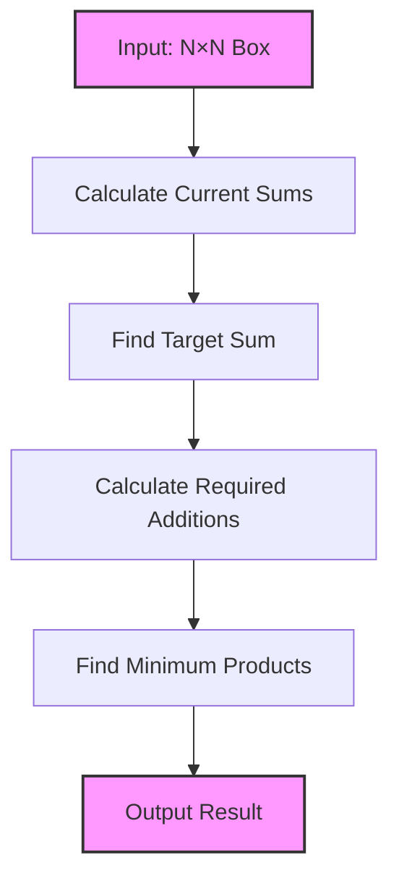
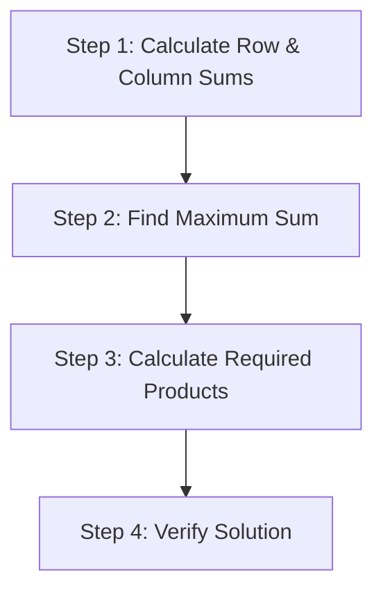
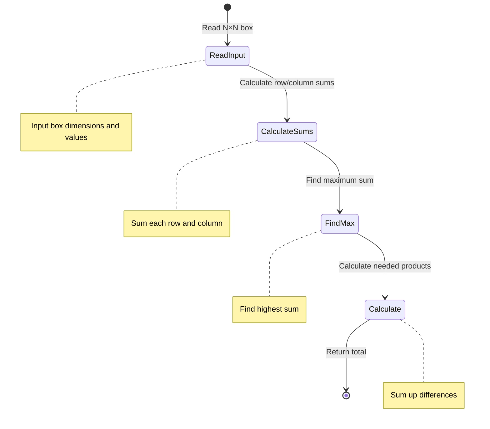
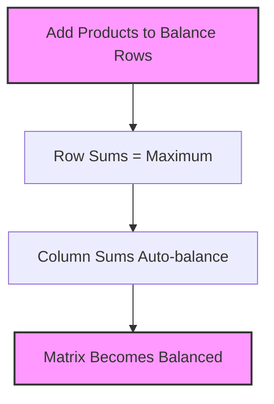
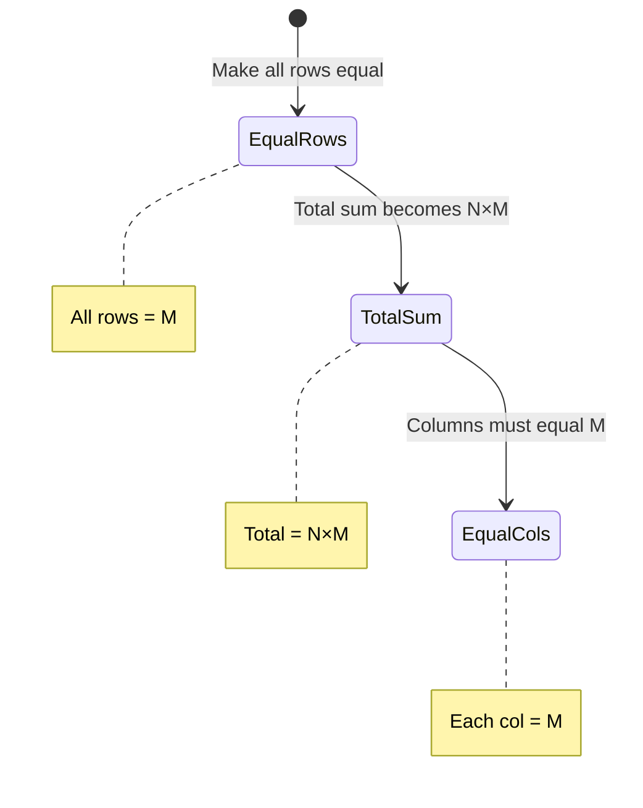
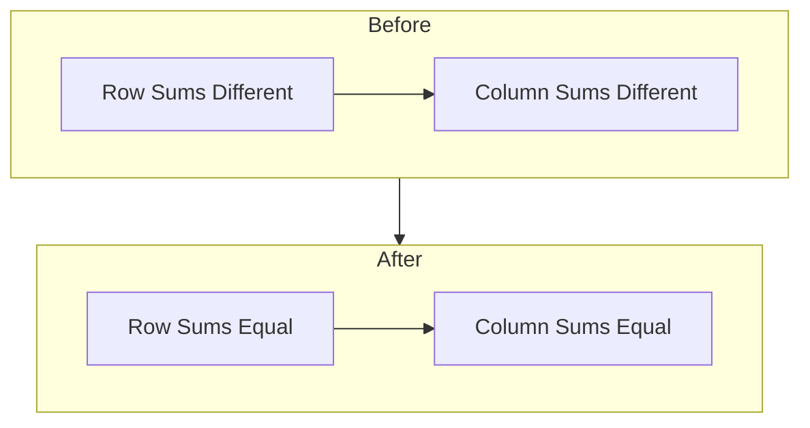

# Balancing Problem Solution

## Problem Understanding

### Requirements
1. Given an N×N lattice box with products
2. Need to balance the box so sum of products in each row and column is equal
3. Can only add products (cannot remove existing ones)
4. Must minimize the total quantity of products added
5. N is the size of box (1 ≤ N ≤ 150)
6. Each lattice can contain up to 200 products



## Solution Approach

### Step 1: Calculate Maximum Sum
- Find the maximum sum among all rows and columns
- This becomes our target sum (all rows and columns must reach this)

### Step 2: Calculate Required Additions
- For each row/column, calculate difference from target sum
- These differences represent minimum products needed

### Complete Solution Code

```java
import java.util.Scanner;

public class Main {
    int N;
    int Box[][];
    
    void InputData() {
        Scanner sc = new Scanner(System.in);
        N = sc.nextInt();
        Box = new int[N][N];
        for(int i=0; i<N; i++) {
            for(int j=0; j<N; j++) {
                Box[i][j] = sc.nextInt();
            }
        }
        sc.close();
    }
    
    public static void main(String[] args) {
        int ans = -1;
        Main m = new Main();
        m.InputData();
        ans = m.solve();
        System.out.println(ans);
    }
    
    int solve() {
        // Find current sums for rows and columns
        int[] rowSums = new int[N];
        int[] colSums = new int[N];
        int maxSum = 0;
        
        // Calculate row and column sums
        for(int i = 0; i < N; i++) {
            for(int j = 0; j < N; j++) {
                rowSums[i] += Box[i][j];
                colSums[j] += Box[i][j];
            }
            maxSum = Math.max(maxSum, rowSums[i]);
        }
        
        for(int j = 0; j < N; j++) {
            maxSum = Math.max(maxSum, colSums[j]);
        }
        
        // Calculate minimum products needed
        int totalProductsNeeded = 0;
        for(int i = 0; i < N; i++) {
            totalProductsNeeded += maxSum - rowSums[i];
        }
        
        return totalProductsNeeded;
    }
}
```

 

## Example 1: 3×3 Box

### Initial State
```
1 2 3
4 2 3
3 2 1
```

### Step-by-Step Solution



#### Step 1: Calculate Sums
```java
Row Sums:
Row 1: 1 + 2 + 3 = 6
Row 2: 4 + 2 + 3 = 9
Row 3: 3 + 2 + 1 = 6

Column Sums:
Col 1: 1 + 4 + 3 = 8
Col 2: 2 + 2 + 2 = 6
Col 3: 3 + 3 + 1 = 7
```

#### Step 2: Find Maximum
```
Maximum sum = max(row sums, column sums)
            = max(6, 9, 6, 8, 6, 7)
            = 9
```

#### Step 3: Calculate Required Products
```
Row 1 needs: 9 - 6 = 3 products
Row 2 needs: 9 - 9 = 0 products
Row 3 needs: 9 - 6 = 3 products

Total products needed = 6
```

## Example 2: 4×4 Box

### Initial State
```
2 1 3 1
1 2 1 3
3 2 1 2
1 3 2 1
```

### Step-by-Step Analysis

#### Step 1: Calculate Sums
```java
Row Sums:
Row 1: 2 + 1 + 3 + 1 = 7
Row 2: 1 + 2 + 1 + 3 = 7
Row 3: 3 + 2 + 1 + 2 = 8
Row 4: 1 + 3 + 2 + 1 = 7

Column Sums:
Col 1: 2 + 1 + 3 + 1 = 7
Col 2: 1 + 2 + 2 + 3 = 8
Col 3: 3 + 1 + 1 + 2 = 7
Col 4: 1 + 3 + 2 + 1 = 7
```

#### Step 2: Find Maximum
```
Maximum sum = max(7, 7, 8, 7, 7, 8, 7, 7)
            = 8
```

#### Step 3: Calculate Required Products
```
Row 1 needs: 8 - 7 = 1 product
Row 2 needs: 8 - 7 = 1 product
Row 3 needs: 8 - 8 = 0 products
Row 4 needs: 8 - 7 = 1 product

Total products needed = 3
```

## Implementation in Code

```java
int solve() {
    // Step 1: Initialize arrays for sums
    int[] rowSums = new int[N];
    int[] colSums = new int[N];
    int maxSum = 0;
    
    // Calculate row and column sums
    for(int i = 0; i < N; i++) {
        for(int j = 0; j < N; j++) {
            rowSums[i] += Box[i][j];
            colSums[j] += Box[i][j];
        }
        // Update maxSum with row sums
        maxSum = Math.max(maxSum, rowSums[i]);
    }
    
    // Update maxSum with column sums
    for(int j = 0; j < N; j++) {
        maxSum = Math.max(maxSum, colSums[j]);
    }
    
    // Calculate minimum products needed
    int totalProductsNeeded = 0;
    for(int i = 0; i < N; i++) {
        totalProductsNeeded += maxSum - rowSums[i];
    }
    
    return totalProductsNeeded;
}
```

## Visualization of the Process



## Edge Cases

### Case 1: Already Balanced Box
```
2 2 2
2 2 2
2 2 2
```
- All sums = 6
- No products needed to add
- Result = 0

### Case 2: Single Cell Box (N=1)
```
5
```
- Already balanced
- Result = 0

### Case 3: Maximum Imbalance
```
1 1 1
1 9 1
1 1 1
```
- Maximum sum = 11 (middle row)
- Other rows need 8 products each
- Result = 16

## Common Pitfalls to Avoid

1. **Forgetting Column Sums**
   - Must check both row and column sums for maximum
   - Both need to be equal in final state

2. **Wrong Maximum**
   - Not considering all rows and columns
   - Using sum instead of maximum

3. **Overflow**
   - With large N and values
   - Use long instead of int if needed

4. **Edge Cases**
   - Not handling N=1
   - Not handling already balanced cases

## Key Points to Remember

1. Time Complexity: O(N²)
   - One pass to read input: O(N²)
   - One pass to calculate sums: O(N²)
   - One pass to calculate additions: O(N)

2. Space Complexity: O(N²)
   - Box array: O(N²)
   - Row/Column sums arrays: O(N)

3. Important Constraints
   - 1 ≤ N ≤ 150
   - Maximum 200 products per cell
   - Can only add products, not remove

4. Edge Cases to Consider
   - N = 1 (single cell)
   - All cells already equal
   - Maximum possible sum in any row/column

## Testing Strategy

1. Test with small inputs (N=1, N=2)
2. Test with already balanced box
3. Test with maximum imbalance
4. Test with edge cases (N=150)
5. Test with single digit vs multiple digit numbers

## Verification Steps
1. Check if input is within constraints
2. Verify row and column sums
3. Confirm minimum number of additions
4. Validate final balanced state is achievable

## Understanding Why Only Row Sums are Sufficient

## Key Insight

When we add products to make all row sums equal to the maximum sum, the column sums will automatically become equal too. Here's why:



## Example Demonstration

Let's take a 3×3 example:
```
Initial State:
1 2 3  (sum = 6)
4 2 3  (sum = 9)
3 2 1  (sum = 6)

Column sums: 8 6 7
```

### Step 1: Find Maximum Sum
- Maximum among all rows and columns = 9

### Step 2: Add Products to Balance Rows
```
1+3 2 3    (sum = 9)
4   2 3    (sum = 9)
3+3 2 1    (sum = 9)

Adding:
Row 1: +3 in first position
Row 3: +3 in first position
```

### Why It Works

1. Initial State:
```
Row Sums:    Column Sums:
R1: 6        C1: 8
R2: 9        C2: 6
R3: 6        C3: 7
```

2. After Adding Products:
```
Row Sums:    Column Sums:
R1: 9        C1: 14 (8+6)
R2: 9        C2: 6
R3: 9        C3: 7
```

## Mathematical Proof

1. **Property of Matrix Sums**:
   - Sum of all row sums = Sum of all column sums
   - This property must hold before and after adding products

2. **When We Balance Rows**:
   - All rows become equal to maximum sum (M)
   - For N×N matrix, total sum = N × M

3. **Column Balance**:
   - Total sum must be distributed equally among N columns
   - Each column must have sum = M



## Why Checking Only Rows is Sufficient

1. **Target Sum Property**:
   - We find maximum among both rows and columns
   - This ensures our target sum is sufficient for both

2. **Balance Property**:
   - When we make all rows equal to maximum
   - Total sum forces columns to be equal too

3. **Minimality**:
   - By using maximum as target
   - We ensure minimum products added

## Visual Representation of Balance



## Important Notes

1. We DO need to check column sums when finding the maximum:
```java
// Find maximum among both rows and columns
for(int j = 0; j < N; j++) {
    maxSum = Math.max(maxSum, colSums[j]);
}
```

2. But we only need to add products to balance rows:
```java
int totalProductsNeeded = 0;
for(int i = 0; i < N; i++) {
    totalProductsNeeded += maxSum - rowSums[i];
}
```

3. The columns will automatically balance because:
   - Total products added = N × maxSum - current_total
   - This difference must distribute evenly across columns
