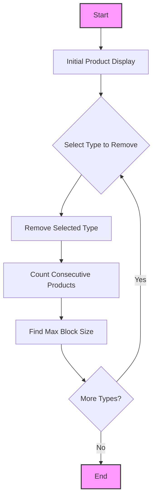
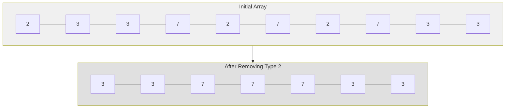
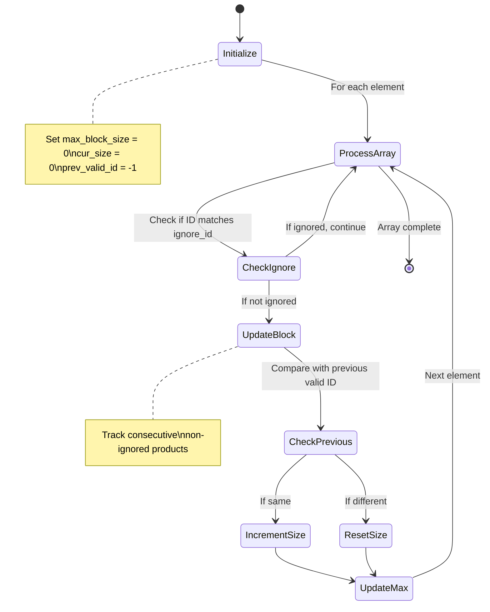
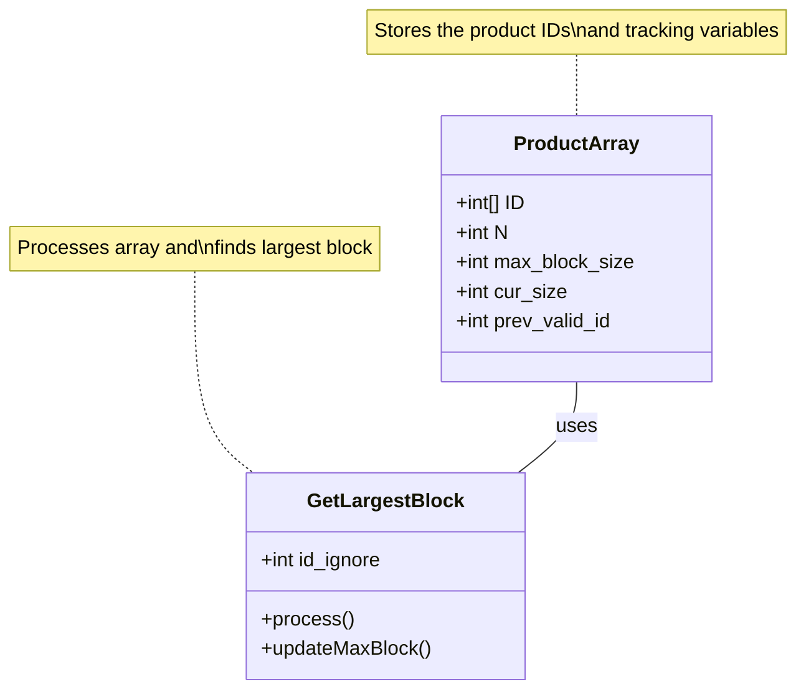

# Product Display Code Understanding

## Visual Process Flow



## Example Process Visualization



## Problem Statement Breakdown

### Context
- Setting: Home appliance store
- Current situation: Products are displayed in a row, but same-type products are scattered
- Goal: Arrange products of the same type together in a row

### Requirements
1. Employee needs to remove products of one type at a time
2. After removing a type, arrange remaining products to maximize products of same type in a row
3. If multiple arrangements are possible, choose the one with highest product count

### Example Given
Initial arrangement: `2 3 3 7 2 7 2 7 3 3`

Steps shown:
1. When type 2 is removed: Products of type 7 form longest row (3 items)
2. When type 3 is removed: Nothing significant
3. When type 7 is removed: Products of types 2 and 3 show in a row

## Code Analysis

### Input Format
```
N (number of products, 1 ≤ N ≤ 1000)
ID[1] ID[2] ... ID[N] (product types, 0 ≤ ID ≤ 1,000,000)
```

### Output Format
- When products of a specific type are removed
- Output the count of same-type products in the maximum length row

### Current Code Explanation

```java
int GetLargestBlock(int id_ignore) {
    int max_block_size = 0;
    int cur_size = 1;
    for (int i = 1; i < N; i++) {
        if (ID[i] == ID[i - 1]) cur_size++;
        else cur_size = 1;
        
        if (max_block_size < cur_size) {
            max_block_size = cur_size;
        }
    }
    return max_block_size;
}
```

This code:
1. Takes a product type to ignore (id_ignore)
2. Maintains two counters:
   - max_block_size: largest block of same products found
   - cur_size: current block size being counted
3. Issue: It doesn't check if current ID should be ignored

### Algorithm Flow Diagram



### Solution Approach

We need to modify the code to:
1. Skip products of type id_ignore
2. Properly count consecutive products of same type
3. Handle edge cases (start/end of array)

Here's the corrected solution:

```java
int GetLargestBlock(int id_ignore) {
    int max_block_size = 0;
    int cur_size = 0;
    int prev_valid_id = -1;
    
    for (int i = 0; i < N; i++) {
        // Skip the ignored product type
        if (ID[i] == id_ignore) continue;
        
        // If same as previous valid ID, increase current block size
        if (ID[i] == prev_valid_id) {
            cur_size++;
        } else {
            // New product type starts
            cur_size = 1;
            prev_valid_id = ID[i];
        }
        
        // Update maximum block size if current is larger
        max_block_size = Math.max(max_block_size, cur_size);
    }
    
    return max_block_size;
}
```

### Key Improvements
1. Added prev_valid_id to track last non-ignored product
2. Properly handle ignored products with continue
3. Initialize cur_size to 0 to handle edge cases
4. Use Math.max for cleaner code

## Testing Examples

Original sequence: 2 3 3 7 2 7 2 7 3 3

Test cases:
1. Remove type 2: Should return 3 (three 7s)
2. Remove type 3: Should return 1 
3. Remove type 7: Should return 2 (two 2s or two 3s)

## Memory Model Visualization



## Time Complexity
- O(N) where N is the number of products
- Single pass through the array
- Constant extra space used

## Space Complexity
- O(1) - only using a few variables regardless of input size
